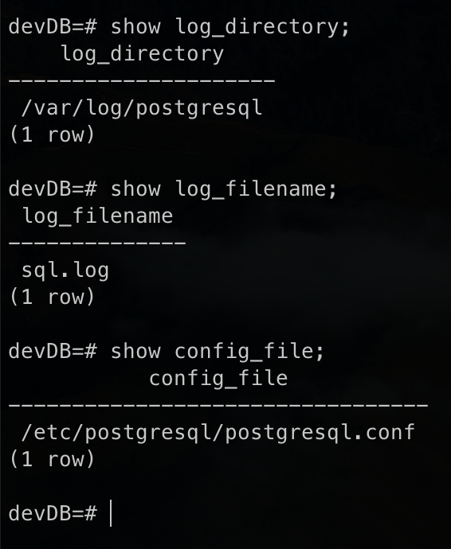

# Login page

### 1. `repository.UserRepository`에서 Optional을 사용하는 이유

- Optional은 값이 없으면 null을 반환하는 역할을 한다. 하지만 여기서 username과 email은 사용자가 사이트를 사용하려면 무조건 있어야 하는 값이여야한다. 그래도 왜 Optional을 사용하는지 궁금했다.

- 이유: 로그인시 잘못된 ID입력, 회원가입 시 중복체크, 비밀번호 재설정(해당 이메일이 없으면 오류반환) 등 이러한 오류를 처리해야하기 때문이다.

    핵심은 DB에는 반드시 존재하는건 맞지만 사용자가 잘못된 username,email 입력 등 이러한 오류를 처리하기 위해서는 `Optional` 이 필요하다.

### 2. `UserRepository`에서 interface 사용하는 이유

- 핵심 : interface를 사용하면 내가 원하는 동작을 JPA 쿼리를 자동 생성해서 실행해준다.

- SpringData JPA는 `Optional<User> findByUsername(String username);`(interface)를 보고 자동으로 구현체를 생성

- 만약에 interface를 안 쓰고 class로 구현할 경우 : 
  ```
  @Repository
  public class UserRepository {

    @PersistenceContext
    private EntityManager em;

    public Optional<User> findByUsername(String username) {
        String jpql = "SELECT u FROM User u WHERE u.username = :username";
        return em.createQuery(jpql, User.class)
                 .setParameter("username", username)
                 .getResultStream()
                 .findFirst();
    }
  ```
- 이런식으로 매 Method 마다 Query + Parameter + 결과 처리를 작성해야하는데 이 과정에서 유지보수, 오타 등 실수가 발생한다.

### 3. interface & class

- interface : 원하는 기능을 정의만 하고, 구현은 하지 않음

  그래서 다양한 class들이 같은 기능을 가지게 하려면 `class implements interface` 처럼 구현한다

- class : 실제로 그 기능이 어떻게 작동할지 코드를 채워넣는 역할

### 4. DTO (Data Transfer Object)

- Client(Frontend) <-> Server 간에 데이터를 주고받을 때 사용하는 전용 객체

### 5. 개발의 흐름

1. DTO : 사용자 입력을 받기 위한 클래스
2. Controller : API endpoint(요청이 들어오는 곳)
3. Repository : DB에서 사용자 정보 조회/저장
4. Service : 비즈니스 로직 처리 
5. Domain : Entity (DB 테이블 맵핑)

### 6. Repository 호출

```aiignore
Optional<User> userOpt = userRepository.findByUsernameOrEmail(request.getLogin());
```

부분에서 `findByUsernameOrEmail`은 `CustomUserRepository`에 있지만 `userRepository`를 사용한 이유

- userRepository에서는 기본적으로 `extends`를 사용하여 `JpaRepository` + `CustomUserRepository`를 상속하기 때문이다

### 7. Test

- `@SpringBootTest`는 실제 앱처럼 모든 Bean을 불러오는데 이때 오류가 발생하면 -> `initializationError` 발생
- 실제 실패 메세지, 응답내용은 테스트 index파일에서 확인 가능하다 : `bulid/reports/tests/test/classes/org.example.UserIntegrationTest.html`
- CSRF Token 때문에 403(Forbidden) 에러 발생

  Cross Site Request Forgery는 사용자가 의도하지 않은 요청을 다른 사이트에서 보내는 공격. 그래서 Spring Security는 이를 막기 위해서 `POST/PUT/DELETE` 요청에는 CSRF토큰을 강제합니다.

  Spring Security는 요청 시 쿠키에 CSRF 토크을 담고, 클라이언트는 이 토큰을 Request Header에 같이 실어서 보냅니다

- 회원가입 / 로그인은 CSRF 요청없이도 작동해야하기 때문에 `SecurityConfig`에서 예외사항을 만들어줌

### 8. Docker

- `resources/application.yml` : SpringBoot 실핼될 때 필요한 설정값들(DB, Port, 로그레벨, 보안설정 등)을 지정해주는 파일

- `Volume` : 데이터를 컨테이너가 종료돼도 유지. Docker가 관리하는 내부 경로에 저장됨

- `pgdata:/var/lib/postgresql/data`에서  `/var/lib/postgresql/data` 는 PostgreSQL의 기본 데이터 Directory

  즉 PostgreSQL의 데이터를 Docker 볼륨에 영속화

- `./postgres/custom_postgresql.conf:/etc/postgresql/postgresql.conf` : "local"에서 custom_postgresql.conf를 수정하게 된다면 나중에 다시 docker-compose down -> up -d 을 하게된다면 Docker Container 안 postgresql.conf 파일이 업데이트 된다.

  이 개념은 local의 conf 파일을 docker 내부에 특정 위치로 Mount 한 것입니다

- pgdata, pglogs 는 Docker가 관리하는 `named volume`이고 Docker의 로컬 스토리지(호스트의 OS의 특정 디렉토리)에 저장된다

  하지만 로컬 스토리지에 저장되어 있기 때문에 컨테이너를 재시작해도 유지된다

- config와 log 경로가 적용되어 있는지 확인하기

  